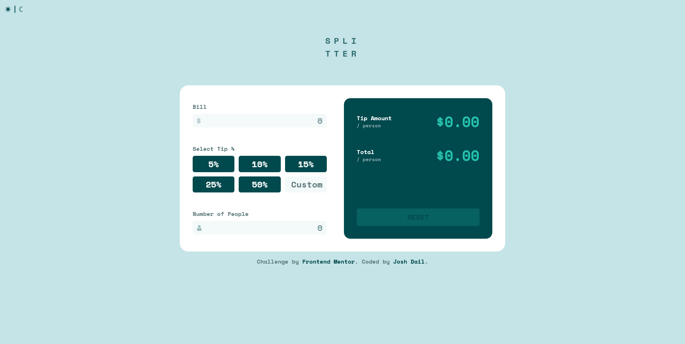
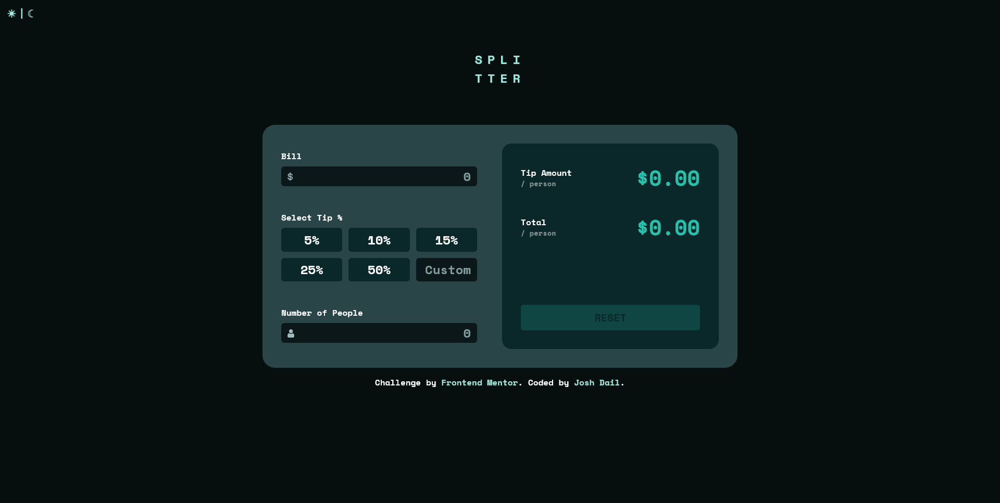

# Frontend Mentor - Tip calculator app solution

This is a solution to the [Tip calculator app challenge on Frontend Mentor](https://www.frontendmentor.io/challenges/tip-calculator-app-ugJNGbJUX). Frontend Mentor challenges help you improve your coding skills by building realistic projects.

## Table of contents

- [Overview](#overview)
  - [The challenge](#the-challenge)
  - [A feature I added](#a-feature-i-added)
  - [Screenshots](#screenshots)
  - [Links](#links)
- [My process](#my-process)
  - [Built with](#built-with)
  - [What I learned](#what-i-learned)
  - [Continued development](#continued-development)
  - [Useful resources](#useful-resources)
- [Author](#author)
- [Acknowledgments](#acknowledgments)

## Overview

### The challenge

Users should be able to:

- View the optimal layout for the app depending on their device's screen size
- See hover states for all interactive elements on the page
- Calculate the correct tip and total cost of the bill per person

### A feature I added

Clicking the icon at the top left of the screen will switch the app to a dark mode.

### Screenshots

Here's a screenshot of the app in dark mode:

### Links

- Solution URL: [https://github.com/joshdail/tip-calculator-app-main](https://github.com/joshdail/tip-calculator-app-main)
- Live Site URL: [https://joshdail.github.io/tip-calculator-app-main/](https://joshdail.github.io/tip-calculator-app-main/)

## My process

### Built with

- CSS custom properties, Flexbox, and Grid
- Vanilla Javascript (no frameworks)
- Desktop-first workflow

### What I learned

One challenge I came across was with placing the SVGs for the dollar sign and person icons within the input boxes. I tried adding a pseudo-class to the input to contain the SVG, but could not get it to work. After some research I learned that html inputs cannot have a ::before or ::after pseudo-class, so I ended up adding empty spans before the inputs, then attaching a ::before pseudoclass to position the SVGs:

    <input
          class="input"
          id="bill"
          type="text"
          inputmode="numeric"
          placeholder="0"
        />

In the above HTML code block, the input is where the user types the amount for the bill. The span contains nothing, but is used in the CSS to position the SVG:

    #bill-pseudo,
    #people-pseudo {
      position: relative;
    }

    #bill-pseudo::before,
    #people-pseudo::before {
      position: absolute;
      z-index: 2;
      top: 0;
      left: 0.5em;
    }

    #bill-pseudo::before {
      content: url("images/icon-dollar.svg");
    }

    #people-pseudo::before {
      content: url("images/icon-person.svg");
    }

When I started working on the input validation, after I got a bit of the basic validation working, I wanted to see if I could eliminate the need for some of the validation checks by filtering out as much invalid input ahead of time as possible. (For example, not even allowing the user to enter non-numeric characters, auto-limiting the decimal places to 2, etc.).

After looking at a few Stack Overflow posts and experimenting with a few Regex strings on regexer.com, I was able to combine string handling and regex filtering to limit the user input. Any letters or non-numeric characters (including the minus symbol) are automatically filtered out and removed from the input. Only positive numbers are allowed, and only the bill amount input allows for decimals.

    const regexNumeralsDecimalsOnly = /[^0-9.]/g
    const regexNumeralsOnly = /[^0-9]/g

(Regex strings stored as constants)

    const filteredInput = billInput.value.replace(regexNumeralsDecimalsOnly, "")
      // Force the input value to two decimals
      const inputValue =
        filteredInput.indexOf(".") >= 0
          ? filteredInput.substr(0, filteredInput.indexOf(".") + 1) +
            filteredInput.substr(filteredInput.indexOf(".") + 1, 2).replace(".", "")
          : filteredInput
      billInput.value = inputValue

      const billAmount = Number(inputValue)

      if (billAmount === 0 && billInput.value !== "") {
        handleBillError("Can't be zero")
        return
      }

The above is a snippet from an event handler. First, the regex filters out anything that is not a number or a decimal. Then, the string is cut down to only allow one decimal and two decimal places. If the input value is zero, then an error message is displayed and the tip will not be calculated.

### Continued development

One area I am specifically interested in is accessibility. My sister is visually impaired, and I've been learning from her how important accessible design is. For example, for her, websites can be very difficult to navigate if they are too bright.

I added a dark mode to this project as an accessibility feature. With the dark mode, in addition to swapping out the brighter colors, I also adjusted some of the font colors to increase contrast. For example, in dark mode, error messages will display in a yellow color that has a higher contrast than the red color in the original design. I did run into a few strange issues with accessibility testing with the Chrome dev tools. In one or two places it gave me odd numbers where it was recommending to me to switch the font color to a lower-contrast color, but saying it was higher contrast (I think this was with the attribution tag).

I also tried to make the buttons keyboard-accessible. The biggest challenge here was on the tip percentage buttons, since those elements are actually radio labels. This was one of the last things I did on this project. I added in some extra event handling for "Enter" keystrokes and it seems to be working.

I would greatly welcome any feedback on how to make this project or similar ones more accessible. Accessibility is an interest of mine but I am far from an expert, and I welcome any advice on how I can improve or things to keep in mind for future projects.

### Useful resources

- [Regexer.com](//https://regexr.com/) - I found out about this site in the Javascript Simplified course by Kyle of Web Dev Simplified. I've always been a bit intimidated by Regex, and this makes experimenting with Regex much easier and understandable. A great resource.

- [CSS Tricks Flexbox Guide](https://css-tricks.com/snippets/css/a-guide-to-flexbox) - I constantly consult this article for making sure my Flex components are set up correctly.

- [Kevin Powell](https://www.kevinpowell.co/) - I have been learning a lot about CSS and design from Kevin's blog, Youtube channel, and courses. Actually found out about Frontend Mentor from him.

- [Web Dev Simplified](https://blog.webdevsimplified.com/) - I really like Kyle's teaching style. Very practical and makes learning things like CSS and Javascript far less overwhelming.

## Author

- Github - [joshdail](https://github.com/joshdail)
- Frontend Mentor - [@joshdail](https://www.frontendmentor.io/profile/joshdail)
